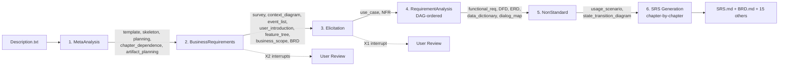

# REagent 1.0 — Architecture

## 1. System Topology

```mermaid
flowchart TB
    subgraph Client
        UI[Frontend / example_client.py / api_smoke_test.py]
    end

    subgraph Proxy[Reverse Proxy]
        NG[nginx:9998<br/>proxy_buffering off]
    end

    subgraph API[FastAPI :8000]
        ROUTES[api/routes/*]
        STREAM[StreamManager<br/>asyncio.Queue per project]
        EXEC[ExecutionService]
    end

    subgraph Worker[Worker Thread - ThreadPoolExecutor max_workers=1]
        RUN[_run_pipeline]
        CREWS[CrewAI Stages<br/>MetaAnalysis → BR → Elicit → Analysis → NonStd → SRS]
        PATCH[Patched run_with_retry<br/>emits SSE on crew_start / artifact_complete]
    end

    subgraph Storage
        MONGO[(MongoDB<br/>projects, uploaded_files)]
        FS[experiment/&#123;project_id&#125;/<br/>*.md + *.pkl]
        TPL[dataset/template-cache/*.pkl<br/>SHA-256 cache]
        CREWSTORE[crewai_storage/&#123;project_id&#125;/]
    end

    subgraph LLM[LLM Provider]
        LLMAPI[OpenAI / DeepSeek / Qwen / UCloud / Zhiyuan]
    end

    UI -- REST+SSE --> NG --> ROUTES
    ROUTES --> EXEC
    ROUTES --> STREAM
    EXEC -- spawn --> RUN
    RUN --> CREWS
    CREWS -- publish_sync --> STREAM
    STREAM -- SSE --> NG --> UI
    RUN -- motor async --> MONGO
    CREWS -- write .md/.pkl --> FS
    CREWS -- read --> TPL
    CREWS -- HTTPS --> LLMAPI
```



## 2. Layered Responsibilities

| Layer | Files | Responsibility |
|-------|-------|----------------|
| Presentation | external | React/Vue UI (not included in repo) |
| HTTP/SSE | [backend/main.py](src/backend/main.py), [backend/api/routes/](src/backend/api/routes/) | Routing, CORS, Pydantic validation |
| Orchestration | [backend/services/execution.py](src/backend/services/execution.py), [backend/services/stream_manager.py](src/backend/services/stream_manager.py) | Run pipeline in worker thread, bridge async/sync, monkey-patch `run_with_retry` for telemetry |
| Domain services | [backend/services/project_service.py](src/backend/services/project_service.py), [backend/services/artifact_service.py](src/backend/services/artifact_service.py), [backend/services/file_service.py](src/backend/services/file_service.py) | CRUD on MongoDB + filesystem |
| CrewAI pipeline | [src/reagent/*.py](src/reagent/) | 6-stage LLM pipeline |
| Utilities | [util/](src/util/) | DAG, path isolation, LLM config, doc templates |
| Persistence | MongoDB + filesystem | `projects`, `uploaded_files` collections; per-project `experiment/{pid}/` |

## 3. Core Module Map

```
backend/
  main.py                       → FastAPI app, registers routes, startup captures event loop
  config.py                     → Settings (Mongo URI, paths, CORS)
  db/mongo.py                   → motor AsyncIOMotorClient singleton; connect_db/close_db/get_db
  api/routes/
    health.py                   → GET /health
    project.py                  → POST/GET/DELETE project CRUD (4 endpoints)
    stream.py                   → POST create, POST resume, GET SSE (3 endpoints)
    artifacts.py                → list, get one, export_pdf (3 endpoints)
    files.py                    → POST /files/upload
  models/
    requests.py                 → Pydantic request schemas (ProjectCreate, StreamCreate, StreamResume)
    responses.py                → Pydantic response schemas
  services/
    project_service.py          → MongoDB project CRUD (motor async)
    execution.py                → _run_pipeline in worker thread; patches run_with_retry
    stream_manager.py           → per-project asyncio.Queue; publish_sync/subscribe
    artifact_service.py         → file scanning; DAG enrichment; 17-artifact registry
    file_service.py             → multipart upload handling

src/reagent/
  main.py                       → CLI entry; RequirementSpecificationrun chapter-by-chapter
  StandardProcess.py            → MetaAnalysisrun, BRDevrun, RequirementElicitationrun,
                                  RequirementAnalysisrun, modify_agent (feedback propagation)
  NonStandardProcess.py         → Usage scenario + state-transition crews
  BusinessRequirements.py       → Survey/ContextDiagram/EventList/UserIntro/
                                  FeatureTree/BusinessScope/BRDev/BRDModify crews
  RequirementElicitation.py     → UserCase + NFR crews
  RequirementAnalysis.py        → DFD/ERD/DataDict/FR/DialogMap crews
  RequirementSpecification.py   → SRS planning + SRS writing crews
  MetaAnalysis.py               → Template extract + planning + dependence crews
  RequirementExtraction.py      → LandingAI PDF/DOCX parser (optional, data_path mode)
  tools/custom_tool.py          → Optional CrewAI tools

util/
  __init__.py                   → run_with_retry, get_reference, template factories
  util.py                       → set_store_path, multiline_input, artifact getters, parsers
  DAG.py                        → topological_sort (Kahn), BFS dependents, cycle detection
  SoftwareManager.py            → SoftwareManagerCrew base (shared LLM + before/after hooks)
  llm_config.py                 → Multi-provider env resolution; build_llm()
  Artifacts.py                  → get_dependence_appendix (markdown summary)
  validate_format.py            → use case JSON schema validator
  user_case.py                  → UserCase dataclass + get_usecase render
  doc_template/
    chapter.py                  → paragraph / CHAPTER classes; markdown rendering
    document.py                 → Document root + parse_skeleton_to_document_template (≤4 levels)
    BusinessRequirement/        → BR class + Initial_template.py (3 chapters)
    SoftwareRequirementSpecification/  → SRS class + Initial_template + IEEE_template
```

## 4. Pipeline Flow (6 Stages, 17 Artifacts)



Stage entry points:
- MetaAnalysis: [StandardProcess.py:48](src/reagent/StandardProcess.py#L48) `MetaAnalysisrun`
- BusinessRequirements: [StandardProcess.py:135](src/reagent/StandardProcess.py#L135) `BRDevrun` — 2 interrupts at L167 and L215
- Elicitation: [StandardProcess.py:235](src/reagent/StandardProcess.py#L235) `RequirementElicitationrun` — 1 interrupt at L259
- Analysis: [StandardProcess.py:277](src/reagent/StandardProcess.py#L277) `RequirementAnalysisrun` — uses `topological_sort(to_artifact_DAG(...))` at L279
- NonStandard: [NonStandardProcess.py](src/reagent/NonStandardProcess.py) `NonStandardProcessrun`
- SRS: [main.py:24](src/reagent/main.py#L24) `RequirementSpecificationrun` — iterates `chapter_sequence` from topological sort

## 5. Key Data Flows

### 5.1 Project Creation → Pipeline Start
```
POST /project/create           → ProjectService.create → MongoDB.projects.insert
POST /graph/stream/create      → ExecutionService.start
                                 → register_feedback_slot(pid)
                                 → set_stream_callback(_emit)
                                 → stream_manager.create_queue(pid)
                                 → loop.run_in_executor(executor, _run_pipeline, pid, config)
GET  /graph/stream/{pid}       → stream_manager.subscribe(pid) → async for events
```

### 5.2 SSE Event Flow (worker → client)
```
Worker thread:                                  Async loop:
  _emit(pid, "stage_start", ...)
    → stream_manager.publish_sync(pid, event)
      → asyncio.run_coroutine_threadsafe(
           stream_manager.publish(pid, event),  → queue.put(event)
           self._loop)                          → subscribe() yields SSE frame
                                                  → client EventSource receives
```

### 5.3 Interrupt / Resume
```
Worker (inside BRDevrun):                       API thread:
  multiline_input(project_id, interrupt_data)
    → _stream_callback emits "interrupt" SSE
    → slot["event"].wait()  [BLOCKS]
                                                POST /graph/stream/resume
                                                  → ExecutionService.resume
                                                    → submit_feedback(pid, mapped_value)
                                                      → slot["value"] = mapped_value
                                                      → slot["event"].set()
    → returns mapped_value
  if answer == "no":  continue past review
  else: modify_agent(feedback) → re-run affected artifacts → re-enter review
```

### 5.4 Feedback Propagation (`modify_agent`)
```
modify_agent(feedback, project_name, Description, reference)
  ↓
  BRDModifyLocateCrew.kickoff(feedback, reference)
  → writes BRD_modify.md containing JSON list of artifacts to re-execute
  ↓
  get_dependent_artifacts(re_execute) ∩ reference
  → BFS forward-graph over Artifact_Dependance_rules
  → computes transitive downstream impact
  ↓
  BRDModifyCrew.kickoff(feedback, Description, project_name, expanded_reference)
  → writes updated artifacts
  ↓
  returns list of re_execute artifacts
  → BRDevrun's while-loop re-runs only matching crews
```

## 6. Storage Model

### MongoDB (`reagent` database)

| Collection | Key fields | Written by |
|------------|-----------|-----------|
| `projects` | `_id` (project_id/UUID), `user_id`, `project_name`, `description`, `srs_template`, `status` (created/running/interrupted/finished/error), `current_stage`, `current_crew`, `created_at`, `updated_at` | `ProjectService.create/update_status` |
| `uploaded_files` | `_id`, `project_id`, `file_type` (data/srs_template), `filename`, `path`, `size_bytes`, `uploaded_at` | `FileService` |

### Filesystem

| Path | Content |
|------|---------|
| `experiment/{project_id}/*.md` | Human-readable artifacts (17 types) |
| `experiment/{project_id}/*.pkl` | Pickled intermediate state (`SRS.pkl`, `BusinessRequirementDocument.pkl`, `UseCase.pkl`) |
| `dataset/template-cache/document_template_<sha256>.pkl` | Cached MetaAnalysis result keyed by SRS example hash |
| `crewai_storage/{project_id}/` | CrewAI's own per-run storage (set via `CREWAI_STORAGE_DIR`) |
| `dataset/uploads/{project_id}/` | User-uploaded data files and custom SRS templates |

## 7. Concurrency Model

| Concern | Mechanism | Location |
|---------|-----------|----------|
| HTTP handling | FastAPI async event loop | [backend/main.py](src/backend/main.py) |
| Pipeline execution | Single worker thread via `ThreadPoolExecutor(max_workers=1)` | [backend/services/execution.py:15](src/backend/services/execution.py#L15) |
| Sync → async event publishing | `asyncio.run_coroutine_threadsafe` against captured main loop | [backend/services/stream_manager.py:49](src/backend/services/stream_manager.py#L49) |
| Async → sync resume signalling | `threading.Event.set()` | [util/util.py:66](src/util/util.py#L66) |
| Per-project path state | `threading.local` + global fallback | [util/util.py:12](src/util/util.py#L12) |
| Per-project event queue | `asyncio.Queue` keyed by `project_id` | [backend/services/stream_manager.py:22](src/backend/services/stream_manager.py#L22) |

**Why single-worker?** The CrewAI pipeline carries process-global state (env vars, cwd, CREWAI_STORAGE_DIR). Even with thread-local paths, concurrent runs would trample each other. Throughput is bounded by LLM latency (20–40 min per project), so a worker pool >1 would need a full process-isolation rewrite.

## 8. Extensibility Anchors

| To add… | Change… |
|---------|---------|
| A new LLM provider | `PROVIDER_SETTINGS` in [util/llm_config.py:69](src/util/llm_config.py#L69) |
| A new artifact | `Artifact_Dependance_rules` in [util/DAG.py:4](src/util/DAG.py#L4), a new `*Crew` class, and register in one of the Stage functions |
| A new interrupt | Call `multiline_input(project_id=…, interrupt_data={"interrupt_type": "…", ...})` and handle the new `resume_type` in [backend/services/execution.py:82](src/backend/services/execution.py#L82) |
| A new SSE event type | Call `_emit(pid, "…", **fields)` in the worker; frontend adds an `es.addEventListener("…")` |
| A new doc template | Add factory in `src/util/doc_template/` and expose in [util/__init__.py](src/util/__init__.py) |

## 9. Known Architectural Issues

See [reagent1.0_UI-report.md §6](reagent1.0_UI-report.md#6-issues--findings) for the full list. Outstanding items (fixed items tracked in [docs/exec-doc/](docs/exec-doc/)):

1. **CLI/API divergence**: [src/reagent/main.py](src/reagent/main.py) calls `StandardProcessrun` which internally runs `MetaAnalysisrun → RequirementElicitationrun → RequirementAnalysisrun` but **skips `BRDevrun`**. The API path in [backend/services/execution.py](src/backend/services/execution.py) calls each phase explicitly, including `BRDevrun`. CLI mode will not produce BRD/survey/etc. artifacts.
2. **Mutable default arguments**: `BRDevrun(…, execute={'all': ''}, feedback_list=[])` and `RequirementElicitationrun` share list/dict across calls — state leaks between sequential runs.
3. **`paragraph.get_last_content()` / `get_all_content()`** reference non-existent `self.CONTENT` / `self.REFERENCE` ([src/util/doc_template/chapter.py:34-46](src/util/doc_template/chapter.py#L34)). Dead code with latent bugs.
4. **Hardcoded 4-level chapter nesting** in `parse_skeleton_to_document_template` ([src/util/doc_template/document.py:110](src/util/doc_template/document.py#L110)) — deeper templates silently truncate.
5. **Interrupt wait has no timeout**: [util/util.py:94](src/util/util.py#L94) `slot["event"].wait()` blocks the worker forever if the frontend closes without sending resume. Partially mitigated by the terminal-state replay on reconnect, but the worker itself still hangs until process restart.
