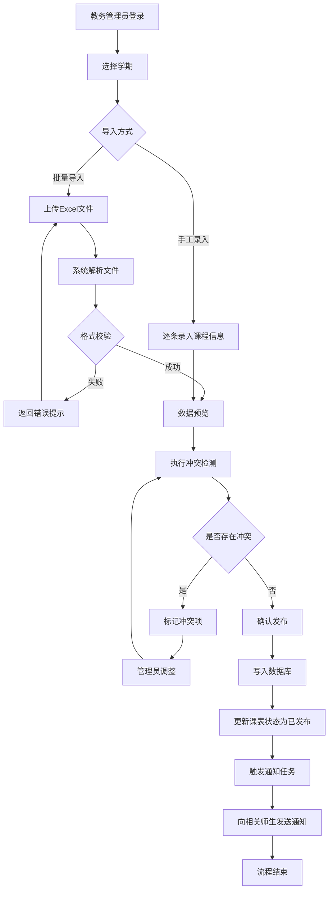
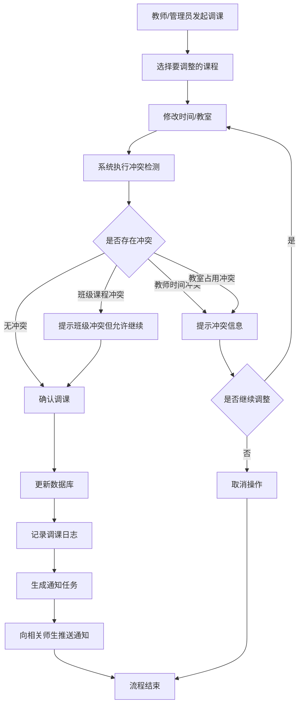
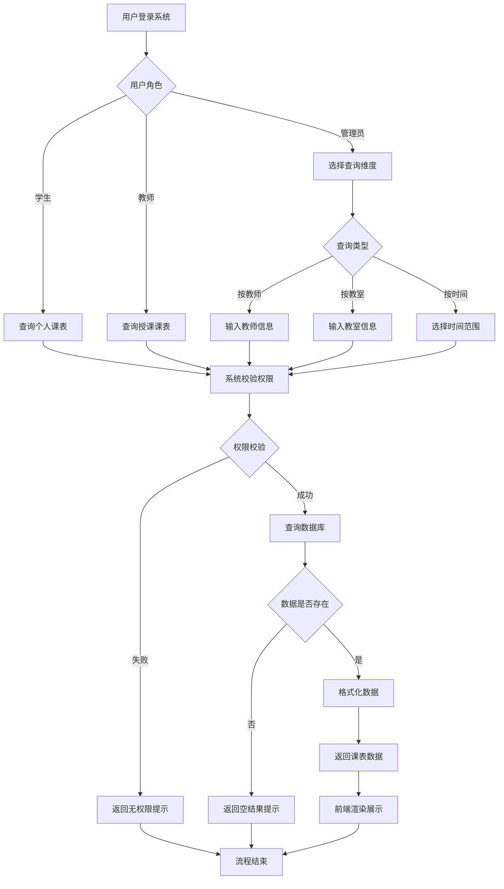
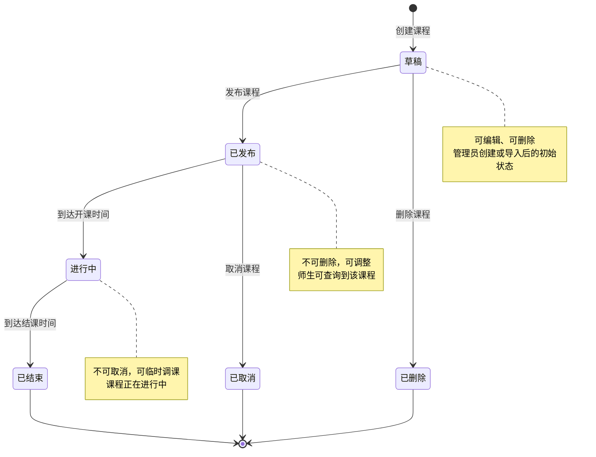
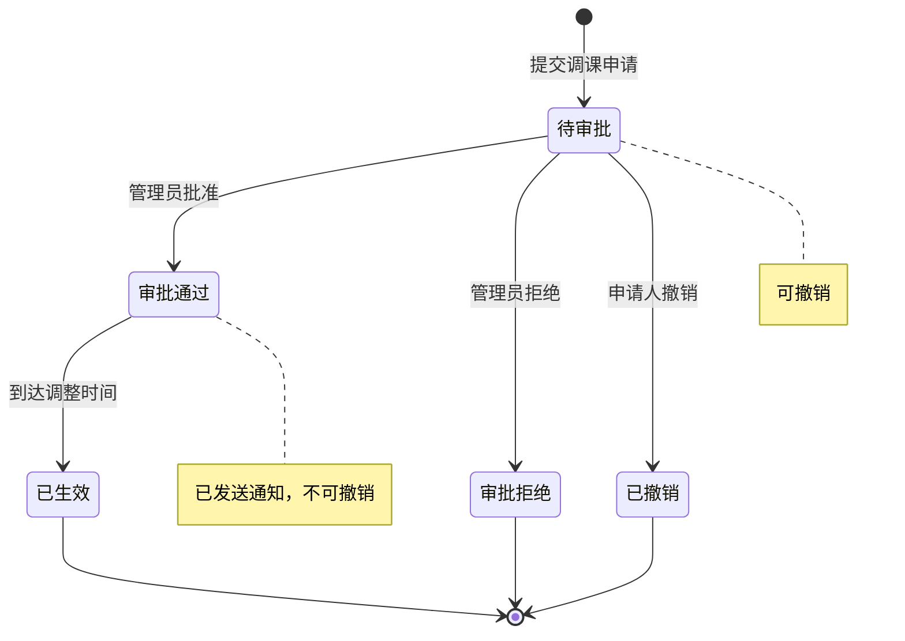
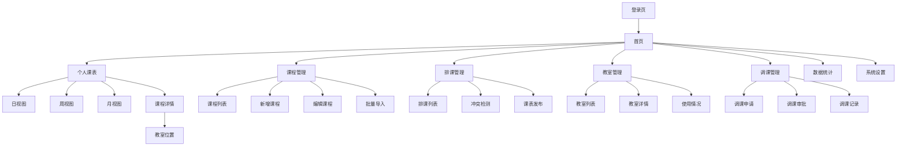

# 课程安排系统 PRD

## 0. 文档版本记录 (Document History)
| 版本号 | 修改日期 | 修改描述 | 修改人 |
| :--- | :--- | :--- | :--- |
| V1.0.0 | 2025-11-24 | 初始版本创建 | AI PM |

## 1. 项目背景与目标（Background & Objectives）

### 1.1 背景说明（Background）
当前学校课程表管理存在以下核心问题：
- **课程信息混乱**：课程时间、地点、教师信息经常出现冲突或错误，导致师生无法准确获取课程安排
- **信息同步滞后**：课程调整后，相关师生无法及时获知变更信息，造成教学事故
- **查询效率低下**：师生需要通过多个渠道（纸质通知、群消息、邮件）才能确认课程信息
- **排课冲突频发**：缺乏系统化的冲突检测机制，导致教室重复占用、教师时间冲突等问题

这些问题的根本原因在于：
1. 缺乏统一的课程信息管理平台
2. 排课过程缺乏自动化校验机制
3. 信息分发渠道分散且不及时

### 1.2 项目目标与成功指标（Objectives & KPIs）
**业务目标：**
- 建立统一的课程信息管理与查询平台
- 实现课程安排的规范化、透明化管理
- 提升师生获取课程信息的效率和准确性

**成功指标：**
- 课程信息错误率降低 90%（从当前约 20% 降至 2% 以下）
- 师生查询课程信息的平均时间从 5 分钟降至 30 秒以内
- 排课冲突检测准确率达到 100%
- 系统响应时间 < 2 秒
- 课程变更通知到达率 > 95%

## 2. 用户分析（User Analysis）

### 2.1 用户角色（Roles）
1. **教务管理员**：负责课程安排、教室分配、课程信息维护
2. **教师**：查询自己的授课安排、教室位置、学生名单
3. **学生**：查看个人课表、课程详情、教室位置

### 2.2 用户画像 (User Personas)

#### 角色 A：教务管理员
- **特征描述**：40-55 岁，熟悉学校教学管理流程，计算机操作能力中等，工作节奏快，需要同时处理多项任务
- **核心诉求**：
  - 快速完成排课工作，避免时间和教室冲突
  - 课程调整后能批量通知相关师生
  - 清晰掌握全校课程安排全貌
- **高频行为**：
  - 每学期初集中录入/导入课程信息
  - 日常处理临时调课申请
  - 查询教室使用情况
  - 导出课表数据用于存档

#### 角色 B：教师
- **特征描述**：25-60 岁，教学任务繁重，需要在多个教室间切换，希望快速获取准确的课程信息
- **核心诉求**：
  - 随时查看本周/本月的授课安排
  - 快速找到教室位置（尤其是临时调换的教室）
  - 了解上课学生名单和人数
- **高频行为**：
  - 每天早晨查看当日课程安排
  - 课前 10 分钟确认教室位置
  - 查询某门课程的学生名单

#### 角色 C：学生
- **特征描述**：18-25 岁，移动端使用习惯强，希望随时随地查看课表，对界面美观度有一定要求
- **核心诉求**：
  - 清晰查看本周课表，避免漏课
  - 及时收到调课通知
  - 快速找到教室位置（尤其是新生）
- **高频行为**：
  - 每周日晚查看下周课表
  - 每天早晨查看当日课程
  - 课前查看教室位置

### 2.3 用户痛点（Pain Points）

**教务管理员痛点：**
- 手工排课容易出现冲突，发现问题时已经通知了师生，造成二次调整
- 临时调课需要逐个通知，效率低且容易遗漏
- 缺乏全局视图，无法快速判断某个时间段的教室使用情况

**教师痛点：**
- 课程信息分散在多个渠道，需要反复确认
- 临时调课通知不及时，导致跑错教室
- 无法提前规划一周的教学安排

**学生痛点：**
- 课表信息不准确，经常跑错教室或漏课
- 调课通知不及时，白跑一趟
- 新生不熟悉教室位置，找教室浪费时间

## 3. 使用场景（Usage Scenarios）

### 场景 1：学期初批量排课
- **情景描述**：新学期开始前两周,教务管理员王老师需要为全校 200 多门课程安排时间和教室，涉及 50 多位教师和 30 多间教室
- **用户旅程**：
  1. 王老师登录系统，导入本学期课程清单（Excel 文件）
  2. 系统自动校验数据格式，提示 3 条错误记录
  3. 王老师修正错误后重新导入
  4. 系统自动检测并标记出 5 处时间冲突和 2 处教室冲突
  5. 王老师逐一调整冲突项
  6. 确认无误后，一键发布课表
  7. 系统自动向所有相关师生发送通知
- **期望结果**：排课工作从原来的 3 天缩短至半天，冲突检测准确率 100%

### 场景 2：教师查看本周课程安排
- **情景描述**：周一早上 7:30，李老师在去学校的地铁上，想确认今天的课程安排和教室位置
- **用户旅程**：
  1. 李老师打开手机，登录系统（或打开已登录的 App）
  2. 首页默认显示"今日课程"，清晰展示上午 10:00-11:40 有一节课
  3. 点击课程卡片，查看详细信息：课程名称、时间、教室（教学楼 A-301）、学生人数
  4. 点击教室号，查看教室位置地图
  5. 切换到"本周视图"，查看本周其他课程安排
- **期望结果**：30 秒内完成查询，信息准确无误，即使在地铁信号不好时也能快速加载

### 场景 3：临时调课通知
- **情景描述**：周三下午，张教授因临时会议需要将周五上午的课程调整到周五下午
- **用户旅程**：
  1. 张教授向教务处提交调课申请
  2. 教务管理员王老师登录系统，找到该课程
  3. 点击"调整时间"，选择新的时间段
  4. 系统自动检测：新时间段教室可用，张教授无其他课程冲突，但有 3 名学生在新时间段有其他课程冲突
  5. 系统提示冲突信息，王老师确认继续调整
  6. 系统自动向该课程的所有学生（80 人）和张教授发送调课通知
  7. 学生收到通知：原周五 8:00-9:40 的《数据结构》调整至周五 14:00-15:40，教室不变
- **期望结果**：调课操作 2 分钟内完成，通知 5 分钟内到达所有相关人员

### 场景 4：学生查看个人课表
- **情景描述**：大一新生小王刚入学，周日晚上想查看下周的课程安排，提前规划学习计划
- **用户旅程**：
  1. 小王打开手机，登录系统
  2. 首页显示"下周课表"，以周视图形式展示周一到周五的所有课程
  3. 点击周一上午的《高等数学》，查看详细信息：教师、教室、时间
  4. 点击教室"教学楼 B-205"，查看教室位置和楼层平面图
  5. 点击"添加到日历"，将课程同步到手机日历
  6. 设置课前 15 分钟提醒
- **期望结果**：清晰了解下周课程安排，不会漏课或跑错教室

## 4. 需求概述（Requirement Overview）

### 4.1 功能模块清单（Feature List）

| 模块名称（Module） | 功能点（Features） | 模块职责说明（Description） |
| :--- | :--- | :--- |
| 用户与权限管理 | 用户登录、角色管理、权限控制 | 管理系统用户身份认证与权限分配，确保不同角色只能访问其权限范围内的功能 |
| 课程信息管理 | 课程创建、课程编辑、课程删除、课程导入、课程导出 | 维护课程基础信息（课程名称、学分、学时、授课教师等），支持批量导入导出 |
| 排课管理 | 课程排期、教室分配、冲突检测、课表发布 | 为课程分配具体的上课时间和教室，自动检测时间和资源冲突，发布正式课表 |
| 课表查询 | 个人课表查询、课程搜索、教室查询、教师课表查询 | 为师生提供多维度的课表查询功能，支持按时间、教师、教室等条件筛选 |
| 调课管理 | 调课申请、调课审批、调课通知 | 处理临时调课需求，自动检测调整后的冲突，批量通知相关人员 |
| 通知管理 | 消息推送、通知记录、通知设置 | 向师生推送课程变更、系统公告等消息，支持多渠道通知（站内信、短信、邮件） |
| 教室管理 | 教室信息维护、教室使用情况查询、教室位置地图 | 维护教室基础信息（容量、设备、位置），提供教室使用情况查询和位置导航 |
| 数据统计与报表 | 课程统计、教室利用率统计、教师工作量统计、数据导出 | 提供多维度的数据统计分析，支持导出报表用于管理决策 |
| 系统配置 | 学期管理、时间段配置、系统参数设置 | 配置系统运行的基础参数（学期起止时间、上课时间段划分等） |

### 4.2 非功能性需求（Non-functional Requirements）

**性能要求：**
- 页面响应时间 < 2 秒（90 分位）
- 课表查询接口响应时间 < 500ms
- 支持 1000 并发用户同时在线
- 批量导入 500 条课程数据 < 10 秒
- 系统可用性 > 99.5%

**安全要求：**
- 用户密码采用加密存储（bcrypt 或类似算法）
- 所有接口进行权限校验，防止越权访问
- 前端输入进行 XSS 防御
- 后端接口进行 SQL 注入防御
- 敏感操作（删除课程、批量调课）需要二次确认
- 登录失败 5 次后锁定账户 30 分钟

**可靠性：**
- 数据库定期备份（每日全量备份 + 实时增量备份）
- 关键操作记录操作日志，可追溯
- 批量操作支持事务回滚
- 外部通知服务（短信、邮件）失败时进行重试（最多 3 次）

**合规性：**
- 遵守《个人信息保护法》，不得泄露师生个人信息
- 学生课表数据仅学生本人和授权教务人员可查看
- 系统操作日志保留至少 6 个月

## 5. 整体业务流程（Business Flow）

### 5.1 业务流程图（Business Process Flow）

#### 5.1.1 排课流程

#### 5.1.2 调课流程

#### 5.1.3 课表查询流程

### 5.2 状态机（State Machine）

#### 5.2.1 课程状态机

#### 5.2.2 调课申请状态机

## 6. 功能需求详情（Functional Requirements Detail）

### 6.1 用户登录

**对应痛点/场景：**
解决用户身份认证问题，确保只有合法用户才能访问系统（对应 2.3 用户痛点）

**前置条件：**
- 用户已在系统中注册或由管理员导入
- 用户拥有有效的账号和密码

**业务流程：**
1. 用户访问登录页面
2. 输入用户名和密码
3. 系统校验用户名和密码
4. 校验通过后，系统生成 Session/Token
5. 返回用户信息和权限列表
6. 跳转到系统首页

**页面交互 (Frontend)：**

字段定义：
| 字段名 | 类型 | 必填 | 校验规则 |
| :--- | :--- | :--- | :--- |
| 用户名 | String | 是 | 长度 4-20 位，支持字母、数字、下划线 |
| 密码 | String | 是 | 长度 6-20 位 |
| 记住我 | Boolean | 否 | - |

操作反馈：
- 点击"登录"按钮后，按钮变为"登录中..."，禁用状态
- 登录成功后，显示"登录成功"提示（1 秒），然后跳转首页
- 登录失败后，显示错误提示："用户名或密码错误"

**逻辑处理 (Backend)：**

**Step 1 参数校验：**
- 校验用户名和密码是否为空
- 校验用户名格式是否符合规则
- 校验密码长度是否符合要求

**Step 2 业务判断：**
- 根据用户名查询用户信息
- 判断用户是否存在
- 判断用户状态是否为"正常"（非锁定、非禁用）
- 判断登录失败次数是否超过限制（5 次）
- 判断账户是否在锁定期内（锁定 30 分钟）
- 使用加密算法校验密码是否正确
- 校验通过后，重置登录失败次数
- 生成 Session/Token，设置过期时间（2 小时）
- 记录登录日志（用户 ID、登录时间、IP 地址）

**Step 3 数据落库：**
- 更新用户表的"最后登录时间"字段
- 如果密码错误，更新"登录失败次数"字段 +1
- 如果登录失败次数达到 5 次，更新"锁定时间"字段为当前时间 + 30 分钟
- 插入登录日志表（用户 ID、登录时间、IP、是否成功）

**异常流程 (Exception)：**
- **场景 A：用户名不存在** → 返回"用户名或密码错误"（不明确提示用户名不存在，避免被恶意探测）
- **场景 B：密码错误** → 返回"用户名或密码错误"，登录失败次数 +1
- **场景 C：账户已锁定** → 返回"账户已锁定，请 XX 分钟后再试"
- **场景 D：账户已禁用** → 返回"账户已被禁用，请联系管理员"
- **场景 E：数据库连接失败** → 返回"系统繁忙，请稍后再试"，记录错误日志

### 6.2 课程信息管理（批量导入）

**对应痛点/场景：**
解决教务管理员学期初需要录入大量课程信息的痛点（对应场景 1）

**前置条件：**
- 用户角色为"教务管理员"
- 已选择目标学期
- 已准备好符合模板格式的 Excel 文件

**业务流程：**
1. 管理员点击"批量导入"按钮
2. 下载导入模板（可选）
3. 上传 Excel 文件
4. 系统解析文件内容
5. 系统校验数据格式和必填项
6. 展示数据预览（包含错误提示）
7. 管理员确认导入
8. 系统执行冲突检测
9. 展示冲突项
10. 管理员调整冲突项
11. 确认无误后，批量写入数据库

**页面交互 (Frontend)：**

字段定义（Excel 模板）：
| 字段名 | 类型 | 必填 | 校验规则 |
| :--- | :--- | :--- | :--- |
| 课程代码 | String | 是 | 长度 6-10 位，唯一 |
| 课程名称 | String | 是 | 长度 2-50 位 |
| 授课教师 | String | 是 | 必须是系统中已存在的教师 |
| 学分 | Number | 是 | 0.5-10，步长 0.5 |
| 学时 | Number | 是 | 16-128 |
| 上课时间 | String | 是 | 格式：周X 第X-X节，如"周一 1-2" |
| 周次范围 | String | 是 | 格式：第X-X周，如"第1-16周" |
| 上课教室 | String | 是 | 必须是系统中已存在的教室 |
| 授课班级 | String | 是 | 多个班级用逗号分隔，如"2024计算机1班,2024计算机2班" |
| 容量 | Number | 是 | 10-500 |

操作反馈：
- 上传文件后，显示"解析中..."进度条
- 解析完成后，显示数据预览表格
- 错误行标红显示，鼠标悬停显示错误原因
- 点击"确认导入"后，显示"导入中..."进度条
- 导入完成后，显示"成功导入 X 条，失败 Y 条"

**逻辑处理 (Backend)：**

**Step 1 参数校验：**
- 校验文件格式是否为 .xlsx 或 .xls
- 校验文件大小是否超过限制（10MB）
- 解析 Excel 文件，校验列名是否与模板一致
- 逐行校验数据格式：
  - 课程代码格式、唯一性
  - 课程名称长度
  - 授课教师是否存在
  - 学分、学时是否在合理范围
  - 上课时间格式是否正确
  - 周次范围格式是否正确
  - 上课教室是否存在
  - 授课班级是否存在（解析逗号分隔的班级列表，每个班级都需要在系统中存在）
  - 容量是否在合理范围

**Step 2 业务判断：**
- 校验课程代码是否已存在（同一学期内）
- 校验授课教师在该时间段是否有其他课程（时间冲突）
- 校验教室在该时间段是否被占用（教室冲突）
- 校验授课班级在该时间段是否有其他课程（班级课程冲突）
- 校验同一教师的周课时是否超过限制（如 20 学时/周）
- 将冲突项标记并返回给前端

**Step 3 数据落库：**
- 开启数据库事务
- 批量插入课程表（课程代码、课程名称、学分、学时、学期 ID、创建时间）
- 批量插入课程安排表（课程 ID、教师 ID、教室 ID、上课时间、周次范围、容量、创建时间）
- 批量插入课程班级关联表（课程 ID、班级 ID，每个班级一条记录）
- 插入操作日志（管理员 ID、操作类型"批量导入"、导入数量、时间）
- 提交事务

**异常流程 (Exception)：**
- **场景 A：文件格式错误** → 返回"文件格式不正确，请使用 Excel 文件（.xlsx 或 .xls）"
- **场景 B：文件过大** → 返回"文件大小超过限制（10MB），请分批导入"
- **场景 C：列名不匹配** → 返回"文件格式不正确，请下载最新模板"
- **场景 D：存在格式错误** → 返回具体错误行和错误原因，允许修正后重新上传
- **场景 E：存在冲突** → 展示冲突项，要求管理员调整后再导入
- **场景 F：数据库写入失败** → 事务回滚，返回"导入失败，请稍后重试"，记录错误日志

### 6.3 个人课表查询（学生）

**对应痛点/场景：**
解决学生需要随时查看课表、避免漏课的痛点（对应场景 4）

**前置条件：**
- 用户已登录
- 用户角色为"学生"
- 当前学期已发布课表

**业务流程：**
1. 学生登录系统
2. 系统自动加载学生的个人课表（默认显示本周）
3. 学生可切换查看方式（日视图/周视图/月视图）
4. 学生可点击具体课程查看详情
5. 学生可查看教室位置地图

**页面交互 (Frontend)：**

字段定义（课表展示）：
| 字段名 | 类型 | 说明 |
| :--- | :--- | :--- |
| 课程名称 | String | 显示在课表格子中 |
| 上课时间 | String | 如"08:00-09:40" |
| 教室 | String | 如"教学楼 A-301" |
| 教师 | String | 授课教师姓名 |
| 周次 | String | 如"第 1-16 周" |

操作反馈：
- 首次加载显示骨架屏（Skeleton）
- 加载完成后，以周视图形式展示课表（周一到周日，每天分为上午/下午/晚上）
- 点击课程卡片，弹出详情弹窗，显示完整信息
- 点击教室号，跳转到教室位置地图页面
- 左右滑动可切换上周/下周
- 点击"今天"按钮，快速回到本周

**逻辑处理 (Backend)：**

**Step 1 参数校验：**
- 校验用户是否已登录（Token 是否有效）
- 校验用户角色是否为"学生"
- 校验查询的周次是否在当前学期范围内

**Step 2 业务判断：**
- 根据用户 ID 查询学生信息（学号、班级、年级）
- 根据学生的班级查询课程安排信息（说明：学生课表由教务管理员在排课时按班级统一分配，无需学生单独选课）
- 根据查询的周次筛选课程（判断课程的起止周次是否包含查询周次）
- 按上课时间排序

**Step 3 数据查询：**
- 查询学生信息表，获取学生所属班级
- 查询课程安排表（班级 ID = 学生班级 ID，学期 ID = 当前学期）
- 关联查询课程表、教师表、教室表
- 查询结果包含：课程名称、教师姓名、教室名称、上课时间、周次范围
- 将结果按周几和时间段分组，格式化为前端需要的数据结构

**异常流程 (Exception)：**
- **场景 A：Token 失效** → 返回 401，前端跳转到登录页
- **场景 B：学生班级未分配课程** → 返回空课表，提示"暂无课程安排"
- **场景 C：查询的学期未发布课表** → 返回"课表尚未发布，请稍后查看"
- **场景 D：数据库查询超时** → 返回"加载失败，请稍后重试"
- **场景 E：网络异常** → 前端显示"网络异常，请检查网络连接"，支持下拉刷新重试

### 6.4 临时调课

**对应痛点/场景：**
解决教师临时需要调整课程时间，需要快速通知学生的痛点（对应场景 3）

**前置条件：**
- 用户角色为"教务管理员"（审批/直接调课）或"授课教师"（申请调课）
- 课程状态为"已发布"或"进行中"
- 调整的目标时间在未来（不能调整已上完的课）

**业务流程：**

**教师申请调课流程：**
1. 教师选择要调整的课程
2. 点击"申请调课"按钮
3. 填写调课信息（新时间、新教室、调课原因）
4. 系统自动检测冲突并提示
5. 教师提交调课申请
6. 系统通知教务管理员审批

**管理员审批/直接调课流程：**
1. 管理员查看调课申请（或直接选择课程进行调整）
2. 点击"审批"或"调课"按钮
3. 选择新的上课时间和/或教室
4. 系统自动检测冲突
5. 如有冲突，展示冲突详情
6. 管理员确认调整
7. 系统更新课程安排
8. 系统自动向相关师生发送通知

**页面交互 (Frontend)：**

字段定义：
| 字段名 | 类型 | 必填 | 校验规则 |
| :--- | :--- | :--- | :--- |
| 原上课时间 | String | - | 只读，展示用 |
| 新上课时间 | DateTime | 是 | 必须在未来，格式：周X 第X-X节 |
| 原教室 | String | - | 只读，展示用 |
| 新教室 | String | 否 | 下拉选择，必须是系统中已存在的教室 |
| 调课原因 | String | 是 | 长度 5-200 位 |

操作反馈：
- 选择新时间后，自动触发冲突检测
- 如有冲突，显示警告提示："检测到冲突：教师在该时间段有其他课程"或"教室已被占用"
- 如有班级课程冲突，显示提示："有 X 个班级在该时间段有其他课程，是否继续？"
- 点击"确认调课"后，显示二次确认弹窗："确认将课程从 [原时间] 调整到 [新时间]？"
- 确认后，显示"调课中..."，完成后显示"调课成功，已通知相关师生"

**逻辑处理 (Backend)：**

**Step 1 参数校验：**
- 校验课程 ID 是否存在
- 校验新上课时间格式是否正确
- 校验新上课时间是否在未来
- 校验新教室是否存在（如果修改了教室）
- 校验调课原因长度是否符合要求

**Step 2 业务判断：**
- 查询课程信息，校验课程状态是否允许调课（已发布/进行中）
- 校验用户权限：
  - **如果是教师**：校验是否为该课程的授课教师，教师只能提交调课申请，不能直接调课
  - **如果是管理员**：可以审批教师的调课申请，也可以直接调整任意课程
- 执行冲突检测：
  - **教师时间冲突**：查询该教师在新时间段是否有其他课程
  - **教室占用冲突**：查询该教室在新时间段是否被占用
  - **班级课程冲突**：查询该课程涉及的班级在新时间段是否有其他课程
- 如果存在教师时间冲突或教室占用冲突，返回错误，不允许调课
- 如果仅存在班级课程冲突，返回警告，但允许管理员强制调课
- **教师申请调课时**：将申请信息保存到调课申请表，状态为"待审批"
- **管理员审批时**：更新申请状态为"审批通过"或"审批拒绝"

**Step 3 数据落库：**

**教师申请调课：**
- 插入调课申请表：课程 ID、申请人 ID、原时间、新时间、原教室、新教室、调课原因、申请时间、状态"待审批"
- 插入通知任务表：通知教务管理员有新的调课申请待审批

**管理员审批通过/直接调课：**
- 开启数据库事务
- 更新课程安排表：上课时间、教室 ID、更新时间
- 如果是审批操作，更新调课申请表：状态改为"审批通过"，审批人 ID、审批时间
- 插入调课记录表：课程 ID、原时间、新时间、原教室、新教室、调课原因、操作人 ID、操作时间
- 插入通知任务表：
  - 查询该课程涉及的所有班级，获取学生 ID 列表
  - 查询该课程的授课教师 ID（如果是管理员直接调课，需要通知教师；如果是教师申请的，不需要重复通知教师）
  - 为每个学生和相关教师生成一条通知记录
  - 通知内容："您的课程《XXX》已调整，原时间：XXX，新时间：XXX，教室：XXX，原因：XXX"
- 提交事务
- 触发异步通知任务（发送站内信/短信/邮件）

**管理员审批拒绝：**
- 更新调课申请表：状态改为"审批拒绝"，审批人 ID、审批时间、拒绝原因
- 通知申请教师：调课申请已被拒绝

**异常流程 (Exception)：**
- **场景 A：课程不存在** → 返回"课程不存在或已删除"
- **场景 B：无权限调课** → 返回"您无权调整该课程"（教师只能申请自己授课的课程）
- **场景 C：教师申请权限校验失败** → 返回"您不是该课程的授课教师，无法申请调课"
- **场景 D：新时间已过去** → 返回"不能调整到过去的时间"
- **场景 E：教师时间冲突** → 返回"教师在该时间段有其他课程：《XXX》，请选择其他时间"
- **场景 F：教室已占用** → 返回"教室在该时间段已被占用，请选择其他教室或时间"
- **场景 G：数据库更新失败** → 事务回滚，返回"调课失败，请稍后重试"
- **场景 H：通知发送失败** → 调课成功，但记录通知失败日志，后台重试发送
- **场景 I：调课申请已存在** → 返回"该课程已有待审批的调课申请，请等待审批完成"

### 6.5 教室使用情况查询

**对应痛点/场景：**
解决教务管理员需要快速了解教室使用情况，避免排课冲突的痛点

**前置条件：**
- 用户角色为"教务管理员"
- 已选择目标学期

**业务流程：**
1. 管理员进入"教室管理"页面
2. 选择查询条件（教室、时间范围）
3. 系统展示教室使用情况（以周视图或日视图形式）
4. 管理员可查看某个时间段哪些教室空闲

**页面交互 (Frontend)：**

字段定义：
| 字段名 | 类型 | 必填 | 校验规则 |
| :--- | :--- | :--- | :--- |
| 教学楼 | String | 否 | 下拉选择 |
| 教室 | String | 否 | 下拉选择，可多选 |
| 查询日期 | Date | 是 | 默认为今天 |
| 时间段 | String | 否 | 如"上午"、"下午"、"全天" |

操作反馈：
- 选择条件后，点击"查询"按钮
- 显示加载动画
- 加载完成后，以表格形式展示教室使用情况
- 表格横轴为时间段（第 1-2 节、第 3-4 节...）
- 表格纵轴为教室
- 已占用的格子显示课程名称和教师，空闲的格子显示"空闲"
- 点击已占用的格子，可查看课程详情

**逻辑处理 (Backend)：**

**Step 1 参数校验：**
- 校验查询日期格式是否正确
- 校验教室 ID 是否存在（如果指定了教室）

**Step 2 业务判断：**
- 根据查询条件，查询课程安排表
- 筛选条件：
  - 学期 ID = 当前学期
  - 教室 ID IN (查询的教室列表)
  - 上课时间包含查询日期（判断周几）
- 按教室和时间段分组
- 查询所有教室信息（如果未指定教室，则查询全部）
- 将课程安排数据和教室列表合并，生成教室使用情况矩阵

**Step 3 数据查询：**
- 查询课程安排表，关联课程表、教师表
- 查询教室表（获取教室列表）
- 将结果格式化为前端需要的数据结构（二维数组）

**异常流程 (Exception)：**
- **场景 A：查询条件为空** → 返回"请至少选择一个查询条件"
- **场景 B：教室不存在** → 返回"教室不存在"
- **场景 C：查询结果为空** → 返回空数据，前端显示"暂无数据"
- **场景 D：数据库查询超时** → 返回"查询超时，请稍后重试"

### 6.6 查看课程学生名单

**对应痛点/场景：**
解决教师需要了解上课学生名单和人数的痛点（对应 2.2 用户画像中教师的核心诉求）

**前置条件：**
- 用户已登录
- 用户角色为"教师"或"教务管理员"
- 课程已发布

**业务流程：**
1. 用户进入课程详情页面或课表页面
2. 点击"查看学生名单"按钮
3. 系统展示该课程的学生列表
4. 用户可查看学生的基本信息
5. 支持导出学生名单（Excel 格式）

**页面交互 (Frontend)：**

字段定义（学生名单展示）：
| 字段名 | 类型 | 说明 |
| :--- | :--- | :--- |
| 序号 | Number | 自动编号 |
| 学号 | String | 学生学号 |
| 姓名 | String | 学生姓名 |
| 班级 | String | 所属班级 |
| 联系方式 | String | 手机号（脱敏显示，如 138****5678） |

操作反馈：
- 点击"查看学生名单"后，弹出学生名单弹窗或跳转到学生名单页面
- 显示加载动画
- 加载完成后，以表格形式展示学生列表
- 表格顶部显示学生总数："共 XX 名学生"
- 支持按姓名、学号搜索
- 点击"导出"按钮，下载 Excel 文件

**逻辑处理 (Backend)：**

**Step 1 参数校验：**
- 校验用户是否已登录（Token 是否有效）
- 校验课程 ID 是否存在
- 校验用户角色是否为"教师"或"教务管理员"

**Step 2 业务判断：**
- 查询课程信息，获取课程状态
- 校验用户权限：
  - **如果是教师**：校验是否为该课程的授课教师，只能查看自己授课课程的学生名单
  - **如果是管理员**：可以查看任意课程的学生名单
- 查询该课程分配的班级列表
- 根据班级查询学生信息

**Step 3 数据查询：**
- 查询课程安排表，获取该课程分配的班级 ID 列表
- 查询学生信息表（班级 ID IN 班级列表）
- 关联查询班级表，获取班级名称
- 查询结果包含：学号、姓名、班级名称、联系方式
- 按学号排序
- 将结果格式化为前端需要的数据结构

**异常流程 (Exception)：**
- **场景 A：Token 失效** → 返回 401，前端跳转到登录页
- **场景 B：课程不存在** → 返回"课程不存在或已删除"
- **场景 C：无权限查看** → 返回"您无权查看该课程的学生名单"（教师只能查看自己授课的课程）
- **场景 D：课程未分配班级** → 返回空列表，提示"该课程暂无学生"
- **场景 E：数据库查询超时** → 返回"加载失败，请稍后重试"

**前置条件：**
- 用户角色为"教务管理员"
- 已选择目标学期

**业务流程：**
1. 管理员进入"教室管理"页面
2. 选择查询条件（教室、时间范围）
3. 系统展示教室使用情况（以周视图或日视图形式）
4. 管理员可查看某个时间段哪些教室空闲

**页面交互 (Frontend)：**

字段定义：
| 字段名 | 类型 | 必填 | 校验规则 |
| :--- | :--- | :--- | :--- |
| 教学楼 | String | 否 | 下拉选择 |
| 教室 | String | 否 | 下拉选择，可多选 |
| 查询日期 | Date | 是 | 默认为今天 |
| 时间段 | String | 否 | 如"上午"、"下午"、"全天" |

操作反馈：
- 选择条件后，点击"查询"按钮
- 显示加载动画
- 加载完成后，以表格形式展示教室使用情况
- 表格横轴为时间段（第 1-2 节、第 3-4 节...）
- 表格纵轴为教室
- 已占用的格子显示课程名称和教师，空闲的格子显示"空闲"
- 点击已占用的格子，可查看课程详情

**逻辑处理 (Backend)：**

**Step 1 参数校验：**
- 校验查询日期格式是否正确
- 校验教室 ID 是否存在（如果指定了教室）

**Step 2 业务判断：**
- 根据查询条件，查询课程安排表
- 筛选条件：
  - 学期 ID = 当前学期
  - 教室 ID IN (查询的教室列表)
  - 上课时间包含查询日期（判断周几）
- 按教室和时间段分组
- 查询所有教室信息（如果未指定教室，则查询全部）
- 将课程安排数据和教室列表合并，生成教室使用情况矩阵

**Step 3 数据查询：**
- 查询课程安排表，关联课程表、教师表
- 查询教室表（获取教室列表）
- 将结果格式化为前端需要的数据结构（二维数组）

**异常流程 (Exception)：**
- **场景 A：查询条件为空** → 返回"请至少选择一个查询条件"
- **场景 B：教室不存在** → 返回"教室不存在"
- **场景 C：查询结果为空** → 返回空数据，前端显示"暂无数据"
- **场景 D：数据库查询超时** → 返回"查询超时，请稍后重试"

### 6.6 查看课程学生名单

**对应痛点/场景：**
解决教师需要了解上课学生名单和人数的痛点（对应 2.2 用户画像中教师的核心诉求）

**前置条件：**
- 用户已登录
- 用户角色为"教师"或"教务管理员"
- 课程已发布

**业务流程：**
1. 用户进入课程详情页面或课表页面
2. 点击"查看学生名单"按钮
3. 系统展示该课程的学生列表
4. 用户可查看学生的基本信息
5. 支持导出学生名单（Excel 格式）

**页面交互 (Frontend)：**

字段定义（学生名单展示）：
| 字段名 | 类型 | 说明 |
| :--- | :--- | :--- |
| 序号 | Number | 自动编号 |
| 学号 | String | 学生学号 |
| 姓名 | String | 学生姓名 |
| 班级 | String | 所属班级 |
| 联系方式 | String | 手机号（脱敏显示，如 138****5678） |

操作反馈：
- 点击"查看学生名单"后，弹出学生名单弹窗或跳转到学生名单页面
- 显示加载动画
- 加载完成后，以表格形式展示学生列表
- 表格顶部显示学生总数："共 XX 名学生"
- 支持按姓名、学号搜索
- 点击"导出"按钮，下载 Excel 文件

**逻辑处理 (Backend)：**

**Step 1 参数校验：**
- 校验用户是否已登录（Token 是否有效）
- 校验课程 ID 是否存在
- 校验用户角色是否为"教师"或"教务管理员"

**Step 2 业务判断：**
- 查询课程信息，获取课程状态
- 校验用户权限：
  - **如果是教师**：校验是否为该课程的授课教师，只能查看自己授课课程的学生名单
  - **如果是管理员**：可以查看任意课程的学生名单
- 查询该课程分配的班级列表
- 根据班级查询学生信息

**Step 3 数据查询：**
- 查询课程安排表，获取该课程分配的班级 ID 列表
- 查询学生信息表（班级 ID IN 班级列表）
- 关联查询班级表，获取班级名称
- 查询结果包含：学号、姓名、班级名称、联系方式
- 按学号排序
- 将结果格式化为前端需要的数据结构

**异常流程 (Exception)：**
- **场景 A：Token 失效** → 返回 401，前端跳转到登录页
- **场景 B：课程不存在** → 返回"课程不存在或已删除"
- **场景 C：无权限查看** → 返回"您无权查看该课程的学生名单"（教师只能查看自己授课的课程）
- **场景 D：课程未分配班级** → 返回空列表，提示"该课程暂无学生"
- **场景 E：数据库查询超时** → 返回"加载失败，请稍后重试"

### 6.7 手工创建课程

**对应痛点/场景：**
解决教务管理员需要单独创建或编辑个别课程的需求（对应 5.1.1 排课流程图中的"手工录入"分支）

**前置条件：**
- 用户角色为"教务管理员"
- 已选择目标学期
- 系统中已有教师和教室基础数据

**业务流程：**
1. 管理员进入"课程管理"页面
2. 点击"新增课程"按钮
3. 填写课程基本信息
4. 填写课程安排信息（时间、教室、班级）
5. 系统自动校验数据格式
6. 系统执行冲突检测
7. 如有冲突，展示冲突详情
8. 管理员确认保存
9. 系统写入数据库

**页面交互 (Frontend)：**

字段定义：
| 字段名 | 类型 | 必填 | 校验规则 |
| :--- | :--- | :--- | :--- |
| 课程代码 | String | 是 | 长度 6-10 位，同一学期内唯一 |
| 课程名称 | String | 是 | 长度 2-50 位 |
| 授课教师 | String | 是 | 下拉选择，必须是系统中已存在的教师 |
| 学分 | Number | 是 | 0.5-10，步长 0.5 |
| 学时 | Number | 是 | 16-128 |
| 上课时间 | String | 是 | 下拉选择，格式：周X 第X-X节，如"周一 1-2" |
| 周次范围 | String | 是 | 格式：第X-X周，如"第1-16周" |
| 上课教室 | String | 是 | 下拉选择，必须是系统中已存在的教室 |
| 授课班级 | Array | 是 | 多选，至少选择一个班级 |
| 容量 | Number | 是 | 10-500，建议不超过教室容量 |

操作反馈：
- 填写完成后，点击"保存"按钮
- 系统自动校验数据格式，如有错误，在对应字段下方显示错误提示
- 执行冲突检测，显示"检测中..."提示
- 如有冲突，显示警告弹窗："检测到冲突：XXX"
- 确认保存后，显示"保存中..."
- 保存成功后，显示"课程创建成功"，并跳转到课程列表页面

**逻辑处理 (Backend)：**

**Step 1 参数校验：**
- 校验所有必填字段是否为空
- 校验课程代码格式和长度
- 校验课程代码在当前学期内是否唯一
- 校验课程名称长度
- 校验授课教师是否存在
- 校验学分、学时是否在合理范围
- 校验上课时间格式是否正确
- 校验周次范围格式是否正确
- 校验上课教室是否存在
- 校验授课班级是否存在
- 校验容量是否在合理范围
- 建议校验：容量不超过教室容量

**Step 2 业务判断：**
- 执行冲突检测：
  - **教师时间冲突**：查询该教师在相同时间段（周几+节次+周次范围有交集）是否有其他课程
  - **教室占用冲突**：查询该教室在相同时间段是否被其他课程占用
  - **班级课程冲突**：查询授课班级在相同时间段是否有其他课程
- 如果存在冲突，返回冲突详情，提示管理员调整
- 校验同一教师的周课时是否超过限制（如 20 学时/周）

**Step 3 数据落库：**
- 开启数据库事务
- 插入课程表：课程代码、课程名称、学分、学时、学期 ID、状态"草稿"、创建时间
- 插入课程安排表：课程 ID、教师 ID、教室 ID、上课时间、周次范围、容量、创建时间
- 插入课程班级关联表：课程 ID、班级 ID（多条记录，每个班级一条）
- 插入操作日志：管理员 ID、操作类型"创建课程"、课程 ID、时间
- 提交事务

**异常流程 (Exception)：**
- **场景 A：课程代码已存在** → 返回"课程代码已存在，请使用其他代码"
- **场景 B：教师不存在** → 返回"授课教师不存在，请先添加教师信息"
- **场景 C：教室不存在** → 返回"教室不存在，请先添加教室信息"
- **场景 D：班级不存在** → 返回"部分班级不存在，请检查班级信息"
- **场景 E：存在冲突** → 返回冲突详情："检测到冲突：XXX"，要求管理员调整
- **场景 F：容量超过教室容量** → 返回警告："课程容量（XX）超过教室容量（XX），建议调整"，但允许继续保存
- **场景 G：数据库写入失败** → 事务回滚，返回"保存失败，请稍后重试"

### 6.8 系统配置管理

**对应痛点/场景：**
解决系统运行所需的基础配置管理需求（对应 4.1 功能模块清单中的"系统配置"模块）

#### 6.8.1 学期管理

**前置条件：**
- 用户角色为"教务管理员"或"系统管理员"

**业务流程：**
1. 管理员进入"系统设置" → "学期管理"页面
2. 点击"新增学期"按钮
3. 填写学期信息（学期名称、起止时间、周数）
4. 保存学期信息
5. 可设置当前学期（系统默认使用当前学期进行排课和查询）

**页面交互 (Frontend)：**

字段定义：
| 字段名 | 类型 | 必填 | 校验规则 |
| :--- | :--- | :--- | :--- |
| 学期名称 | String | 是 | 如"2024-2025学年第一学期"，长度 5-30 位 |
| 开始日期 | Date | 是 | 格式：YYYY-MM-DD |
| 结束日期 | Date | 是 | 必须晚于开始日期 |
| 总周数 | Number | 是 | 16-20 周 |
| 是否当前学期 | Boolean | 否 | 只能有一个学期为当前学期 |

**逻辑处理 (Backend)：**

**Step 1 参数校验：**
- 校验学期名称长度
- 校验开始日期和结束日期格式
- 校验结束日期必须晚于开始日期
- 校验总周数是否在合理范围
- 校验学期名称是否已存在

**Step 2 业务判断：**
- 如果设置为当前学期，需要将其他学期的"当前学期"标记取消
- 校验日期范围是否与已有学期重叠（警告级别，允许保存）

**Step 3 数据落库：**
- 插入学期表：学期名称、开始日期、结束日期、总周数、是否当前学期、创建时间
- 如果设置为当前学期，更新其他学期的"是否当前学期"字段为 false

**异常流程 (Exception)：**
- **场景 A：学期名称已存在** → 返回"学期名称已存在"
- **场景 B：日期格式错误** → 返回"日期格式不正确"
- **场景 C：结束日期早于开始日期** → 返回"结束日期必须晚于开始日期"

#### 6.8.2 时间段配置

**前置条件：**
- 用户角色为"教务管理员"或"系统管理员"

**业务流程：**
1. 管理员进入"系统设置" → "时间段配置"页面
2. 查看当前的节次时间配置
3. 点击"编辑"按钮，修改节次对应的具体时间
4. 保存配置

**页面交互 (Frontend)：**

字段定义：
| 字段名 | 类型 | 必填 | 校验规则 |
| :--- | :--- | :--- | :--- |
| 节次 | String | 是 | 如"第1-2节"，只读 |
| 开始时间 | Time | 是 | 格式：HH:mm，如"08:00" |
| 结束时间 | Time | 是 | 格式：HH:mm，必须晚于开始时间 |

**逻辑处理 (Backend)：**

**Step 1 参数校验：**
- 校验时间格式是否正确
- 校验结束时间必须晚于开始时间
- 校验时间段是否与其他节次重叠

**Step 2 业务判断：**
- 校验时间段的合理性（如第1-2节应在上午，第3-4节应在下午等）

**Step 3 数据落库：**
- 更新时间段配置表：节次、开始时间、结束时间、更新时间

**异常流程 (Exception)：**
- **场景 A：时间格式错误** → 返回"时间格式不正确"
- **场景 B：结束时间早于开始时间** → 返回"结束时间必须晚于开始时间"
- **场景 C：时间段重叠** → 返回"时间段与其他节次重叠"

#### 6.8.3 基础数据管理

**前置条件：**
- 用户角色为"教务管理员"或"系统管理员"

**业务流程：**

**教师信息管理：**
1. 管理员进入"系统设置" → "教师管理"页面
2. 可批量导入教师信息（Excel 文件）或手工添加
3. 可编辑、删除教师信息
4. 删除教师前需校验是否有关联课程

**教室信息管理：**
1. 管理员进入"系统设置" → "教室管理"页面
2. 可批量导入教室信息（Excel 文件）或手工添加
3. 可编辑、删除教室信息
4. 删除教室前需校验是否有关联课程

**班级信息管理：**
1. 管理员进入"系统设置" → "班级管理"页面
2. 可批量导入班级信息（Excel 文件）或手工添加
3. 可编辑、删除班级信息
4. 删除班级前需校验是否有关联课程和学生

**页面交互 (Frontend)：**

教师信息字段：
| 字段名 | 类型 | 必填 | 校验规则 |
| :--- | :--- | :--- | :--- |
| 教师工号 | String | 是 | 长度 6-10 位，唯一 |
| 教师姓名 | String | 是 | 长度 2-20 位 |
| 所属院系 | String | 否 | 长度 2-30 位 |
| 联系方式 | String | 否 | 手机号格式 |

教室信息字段：
| 字段名 | 类型 | 必填 | 校验规则 |
| :--- | :--- | :--- | :--- |
| 教室编号 | String | 是 | 如"A-301"，长度 3-10 位，唯一 |
| 教学楼 | String | 是 | 如"教学楼A"，长度 2-20 位 |
| 容量 | Number | 是 | 10-500 |
| 设备 | String | 否 | 如"投影仪、音响"，长度 0-100 位 |

班级信息字段：
| 字段名 | 类型 | 必填 | 校验规则 |
| :--- | :--- | :--- | :--- |
| 班级编号 | String | 是 | 如"2024计算机1班"，长度 5-20 位，唯一 |
| 所属年级 | String | 是 | 如"2024级" |
| 所属专业 | String | 是 | 如"计算机科学与技术" |
| 班级人数 | Number | 是 | 10-200 |

**逻辑处理 (Backend)：**

**Step 1 参数校验：**
- 校验所有必填字段
- 校验数据格式和长度
- 校验唯一性（工号、教室编号、班级编号）

**Step 2 业务判断：**
- 批量导入时，校验数据格式和重复项
- 删除时，校验是否有关联数据（课程、学生）

**Step 3 数据落库：**
- 插入或更新教师表、教室表、班级表
- 删除时，如果有关联数据，返回错误；如果无关联数据，执行删除

**异常流程 (Exception)：**
- **场景 A：工号/编号已存在** → 返回"XXX已存在"
- **场景 B：删除时有关联数据** → 返回"该XXX已被课程使用，无法删除"
- **场景 C：批量导入格式错误** → 返回具体错误行和错误原因

## 7. 非功能性需求 (NFR)

### 7.1 性能要求
- **响应时间**：
  - 课表查询接口：P50 < 300ms，P90 < 500ms，P99 < 1s
  - 课程列表查询：P50 < 500ms，P90 < 1s，P99 < 2s
  - 批量导入（500 条）：< 10s
  - 页面首屏加载：< 2s
- **并发能力**：
  - 支持 1000 并发用户同时在线
  - 支持 100 QPS 的课表查询请求
- **数据量**：
  - 支持 10000+ 门课程
  - 支持 50000+ 学生
  - 支持 1000+ 教师

### 7.2 安全性
- **认证与授权**：
  - 所有接口必须进行 Token 校验
  - 敏感接口（删除、批量操作）必须进行权限二次校验
  - Token 有效期 2 小时，支持自动续期
- **数据安全**：
  - 用户密码采用 bcrypt 加密存储，加盐（salt）长度 ≥ 10
  - 敏感数据（手机号、邮箱）脱敏展示
  - 数据库连接使用加密传输（SSL/TLS）
- **攻击防御**：
  - 前端输入进行 XSS 过滤（转义特殊字符）
  - 后端使用参数化查询，防止 SQL 注入
  - 接口增加频率限制（Rate Limiting）：同一用户 1 分钟内最多调用 100 次
  - 登录接口增加验证码（连续失败 3 次后触发）
  - 防止 CSRF 攻击（使用 Token 机制）

### 7.3 可靠性
- **数据备份**：
  - 数据库每日凌晨 2:00 进行全量备份
  - 增量备份每 4 小时一次
  - 备份数据保留 30 天
- **容错机制**：
  - 关键操作（批量导入、调课）支持事务回滚
  - 外部服务（短信、邮件）调用失败时，进行重试（最多 3 次，间隔 5 秒）
  - 数据库主从切换时，系统自动切换到从库
- **监控与告警**：
  - 接口响应时间超过 2s 时，触发告警
  - 数据库连接池使用率超过 80% 时，触发告警
  - 系统错误率超过 1% 时，触发告警

### 7.4 数据统计
**关键埋点需求：**
- **页面访问统计**：
  - 页面名称、用户 ID、访问时间、停留时长
  - 埋点位置：所有页面的 onLoad 和 onUnload 事件
- **功能使用统计**：
  - 课表查询：查询类型（日/周/月）、查询时间
  - 批量导入：导入数量、成功数、失败数、耗时
  - 调课操作：调课次数、调课原因分布
  - 埋点位置：关键操作的成功回调
- **性能监控**：
  - 接口响应时间、成功率、错误码分布
  - 埋点位置：接口拦截器

## 8. 页面结构（Page Structure）

### 8.1 页面关系图

### 8.2 移动端/PC 适配说明

**PC 端（管理员）：**
- 采用左侧导航栏 + 右侧内容区的布局
- 支持多标签页切换
- 表格支持排序、筛选、分页
- 适配屏幕分辨率：1366x768 及以上

**移动端（师生）：**
- 采用底部 Tab 导航（首页、课表、我的）
- 课表采用卡片式布局，支持左右滑动切换周次
- 支持下拉刷新、上拉加载更多
- 适配屏幕尺寸：iOS（375x667 及以上）、Android（360x640 及以上）
- 关键操作支持手势：左右滑动切换周次、长按课程卡片查看详情

**响应式设计：**
- PC 端访问时，展示完整功能
- 移动端访问时，隐藏部分管理功能（仅保留查询功能）
- 平板设备（768px-1024px）采用混合布局

## 9. 逻辑自检与风险评估 (Self-Verification)

### 9.1 完整性检查

**流程闭环检查：**
- ✅ 排课流程：从导入 → 校验 → 冲突检测 → 发布 → 通知，流程完整
- ✅ 调课流程：从发起 → 冲突检测 → 确认 → 更新 → 通知，流程完整
- ✅ 查询流程：从登录 → 权限校验 → 查询 → 展示，流程完整
- ✅ 登录流程：从输入 → 校验 → 生成 Token → 跳转，流程完整

**数据流检查：**
- ✅ 课程数据：创建 → 发布 → 查询 → 调整 → 结束，状态流转完整
- ✅ 通知数据：触发 → 生成 → 发送 → 记录，流程完整

**异常处理检查：**
- ✅ 所有关键功能均定义了异常流程
- ✅ 数据库操作失败时有事务回滚机制
- ✅ 外部服务调用失败时有重试机制

### 9.2 场景覆盖检查

**场景 1（学期初批量排课）覆盖情况：**
- ✅ 支持批量导入课程（6.2 功能）
- ✅ 支持自动冲突检测（6.2 业务判断）
- ✅ 支持一键发布并通知（6.2 数据落库）
- ✅ 覆盖完整

**场景 2（教师查看本周课程）覆盖情况：**
- ✅ 支持个人课表查询（6.3 功能）
- ✅ 支持多视图切换（日/周/月）
- ✅ 支持查看教室位置（6.3 页面交互）
- ✅ 覆盖完整

**场景 3（临时调课通知）覆盖情况：**
- ✅ 支持调课操作（6.4 功能）
- ✅ 支持自动冲突检测（6.4 业务判断）
- ✅ 支持批量通知（6.4 数据落库）
- ✅ 覆盖完整

**场景 4（学生查看个人课表）覆盖情况：**
- ✅ 支持个人课表查询（6.3 功能）
- ✅ 支持查看课程详情和教室位置（6.3 页面交互）
- ✅ 明确了课表数据来源：按班级统一分配，无需学生选课
- ⚠️ 部分覆盖："添加到日历"功能未在 PRD 中详细定义（可作为二期需求）

**遗漏场景识别：**
- ✅ **场景补充 1**：教师申请调课 - 已在 6.4 中补充完整
- ⚠️ **场景补充 2**：课程评价
  - 学生在课程结束后，可能需要对课程进行评价
  - 建议作为二期需求

### 9.3 边界检查

**数据边界：**
- ✅ 登录失败次数限制（5 次）
- ✅ 文件大小限制（10MB）
- ✅ 批量导入数量限制（500 条）
- ⚠️ **潜在问题 1**：如果某个教师有 100 门课程，查询时可能导致性能问题
  - 建议：增加分页查询，每页最多显示 50 条
- ⚠️ **潜在问题 2**：如果某门课程有 5000 名学生，调课通知可能导致消息队列堵塞
  - 建议：通知任务采用异步队列，分批发送（每批 100 条）

**时间边界：**
- ✅ 调课时不能调整到过去的时间
- ⚠️ **潜在问题 3**：如果在课程开始前 5 分钟调课，学生可能来不及看到通知
  - 建议：增加调课时间限制，课程开始前 2 小时内不允许调课（紧急情况除外）

**并发边界：**
- ⚠️ **潜在问题 4**：两个管理员同时调整同一门课程，可能导致数据不一致
  - 建议：在调课时增加乐观锁或悲观锁机制
- ⚠️ **潜在问题 5**：批量导入时，如果两个管理员同时导入相同的课程代码，可能导致重复
  - 建议：在导入前增加全局锁，同一时间只允许一个管理员执行批量导入

**极端情况：**
- ⚠️ **数据库主从延迟**：如果主从延迟超过 1 秒，学生查询课表时可能看到旧数据
  - 建议：关键操作（调课）后，强制从主库读取；或增加缓存失效机制
- ⚠️ **短信/邮件服务不可用**：如果第三方服务长时间不可用，通知任务会堆积
  - 建议：增加降级策略，仅发送站内信；或增加通知任务过期机制（超过 24 小时的任务自动标记为失败）

### 9.4 歧义消除

**可能被误解的描述：**
1. **"课程状态为已发布"**
   - ❌ 歧义：开发人员可能不清楚"已发布"的具体含义
   - ✅ 明确：已发布 = 课程信息已确认无误，且已向师生公开，师生可在系统中查询到该课程
   
2. **"自动检测冲突"**
   - ❌ 歧义：开发人员可能不清楚需要检测哪些类型的冲突
   - ✅ 明确：冲突包括三类：
     - 教师时间冲突：同一教师在同一时间段有多门课程
     - 教室占用冲突：同一教室在同一时间段被多门课程占用
     - 班级课程冲突：同一班级在同一时间段有多门课程（警告级别，不阻止操作）

3. **"批量通知相关师生"**
   - ❌ 歧义：开发人员可能不清楚"相关师生"的范围
   - ✅ 明确：相关师生 = 该课程的授课教师 + 该课程分配的所有班级的学生

4. **"上课时间"格式**
   - ❌ 歧义："周一 1-2" 可能被理解为 1 点到 2 点
   - ✅ 明确："周一 1-2" 表示周一第 1-2 节课，具体时间由系统配置决定（如第 1-2 节 = 08:00-09:40）

5. **"课程容量"**
   - ❌ 歧义：开发人员可能不清楚容量是教室容量还是课程容量
   - ✅ 明确：课程容量 = 该门课程允许选修的最大学生数，可能小于或等于教室容量

### 9.5 技术细节检查

**文档中是否包含技术细节：**
- ✅ 未指定具体的数据库表结构（仅描述需要 Create/Update 哪些关键字段）
- ✅ 未指定具体的接口路径和参数格式（仅描述输入输出）
- ✅ 未指定具体的加密算法（仅要求"使用加密算法"）
- ✅ 未指定具体的前端框架和技术栈
- ✅ 文档符合"可以指导技术人员开发，但本身不包含技术细节"的要求

### 9.6 风险评估

**高风险项：**
1. **数据一致性风险**：并发调课、批量导入时可能出现数据不一致
   - 缓解措施：增加锁机制、事务控制
2. **性能风险**：大规模通知发送可能导致系统响应变慢
   - 缓解措施：采用异步队列、分批发送
3. **第三方依赖风险**：短信/邮件服务不可用时，通知无法送达
   - 缓解措施：增加降级策略、重试机制

**中风险项：**
1. **用户体验风险**：移动端网络不稳定时，课表加载缓慢
   - 缓解措施：增加缓存机制、离线查看功能
2. **数据质量风险**：批量导入时，数据格式错误率高
   - 缓解措施：提供详细的模板说明、增加数据校验规则

**低风险项：**
1. **学习成本**：新用户可能不熟悉系统操作
   - 缓解措施：提供操作指引、新手引导

---

## 附录：术语表

| 术语 | 定义 |
| :--- | :--- |
| 课程 | 指一门具体的教学科目，如《高等数学》 |
| 课程安排 | 指课程的具体上课时间、地点、教师等信息 |
| 排课 | 指为课程分配上课时间和教室的过程 |
| 调课 | 指修改已发布课程的上课时间或教室 |
| 冲突 | 指时间或资源上的重复占用 |
| 学期 | 指一个完整的教学周期，通常为 16-18 周 |
| 节次 | 指一天中的上课时间段，如第 1-2 节（08:00-09:40） |
| 周次 | 指学期中的第几周，如第 1 周、第 2 周 |

---

**文档结束**

